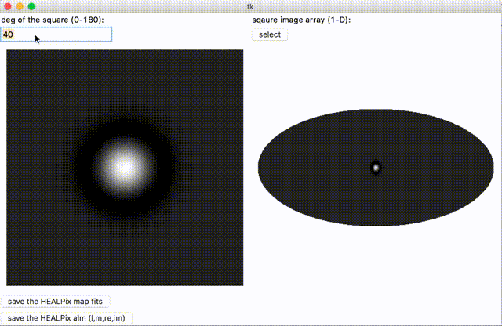

# Square2Healpix
It is just a Tkinter interface to put a square image (in 1-D array) on the center of a HEALPix map.

# How to use
- Still need to install `python(3+)`, `healpy`, `numpy`, and `matplotlib` _(because right now I was unable to make a app. `py2app` and `pysintaller` have some difficultes to package `astropy` and `matplotlib`)_
- In command line,
```bash
$ python Tkinter_healpy.py
```
- In the Tkinter interface, specifiy the **deg (0 < deg <= 180)** and select the image file by clicking **select**  (should be a 1-D array and readable by `np.loadtxt`) , 

- Well, this is my first time to use Tkinter, so the interface may be a little bit user-unfriendly. I will improve it in the future.
